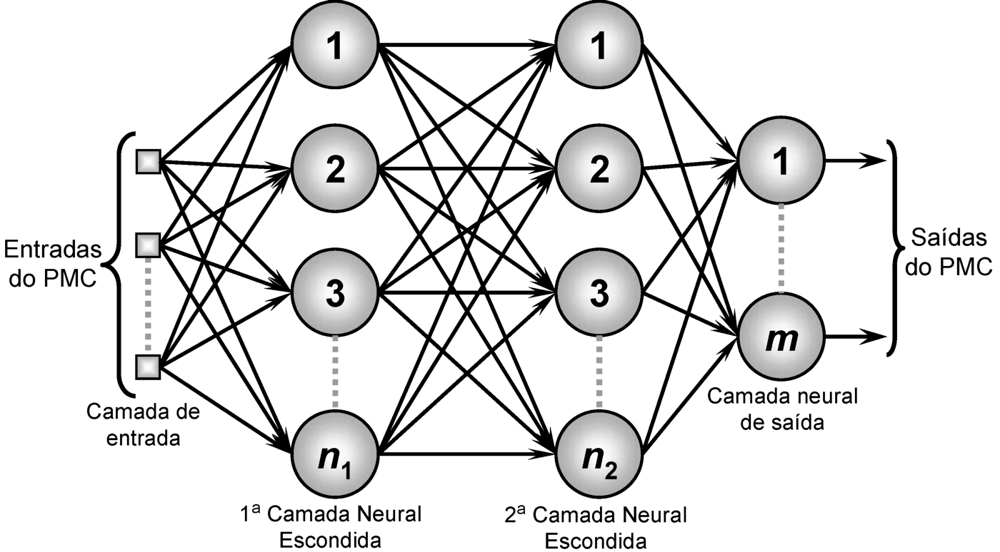

### perceptron_multi_camadas.py
* Rede PMC (Perceptron Multicamadas), MLP (Multilayer perceptron) - semelhante a rede Perceptron de 1958, mas com mais de uma camada
* Correção dos pesos de 'modo padrão', a correção dos pesos é realizada a cada iteração e se baseia apenas na entrada atual
* Ativação por Sigmoid Function
* Treinamento por Backpropagation

